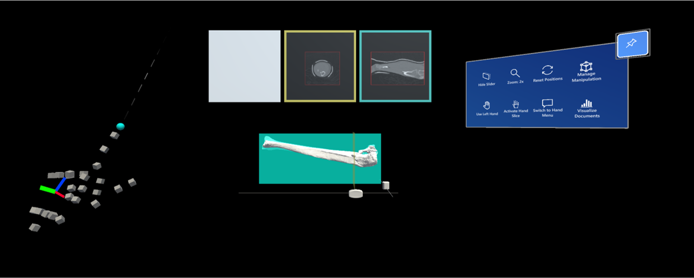

<h1 align="right">
  
</h1>

# AR Surgery Enhancement Application

This repository contains the surgery enhancement tool developed by CustomSurg for the Microsoft HoloLens 2.

The latest version to install on the HoloLens can be found [here](https://github.com/SimonCom/AR/releases) on this Github repository. Please add a new release whenever a new working feature is implemented or an important bug is fixed (a how-to can be found [here](doc/building-project.md)).

## Project Description

The goal of this project is to create a HoloLens 2 application able to assist surgeons during complex fracture surgeries. In some critical cases, bones can be fractured into many separate pieces that need to be realigned and fixed with an artificial supportive structure. The position and orientation of the bone structures is usually not well visible during the surgery, and surgeons have to remember their position from the scan inspection prior to the surgery. The major task is hence to allow surgeons to reinspect the scan data during the surgery and better understand individual bone positions as needed.

Using the HoloLens 2 to do so would be of great benefit, since the surgeon can't physically touch any object during the surgery, to not compromise the sterilization of the surgery room.

A full documentation on the implemented features can be found [here](doc/documentation-features.md).

## Development Guides

- [Installation](doc/installation-instructions.md)
- [Building the project](doc/building-project.md)
- [Changing the patient](doc/patient-switch-instructions.md)
