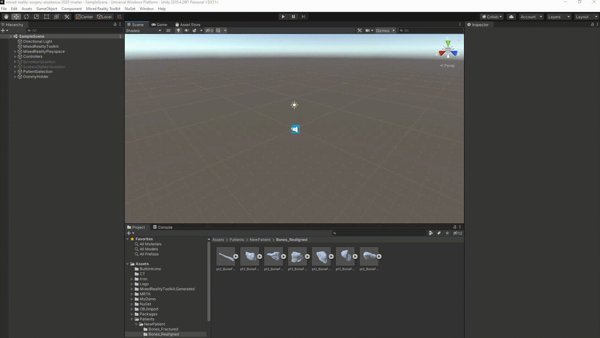
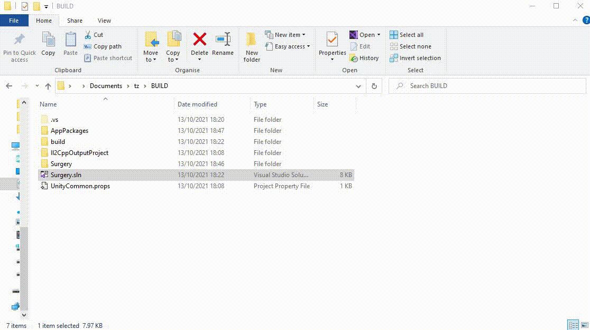
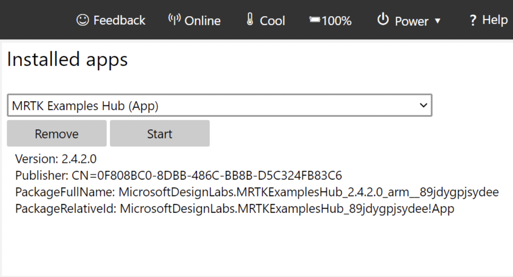
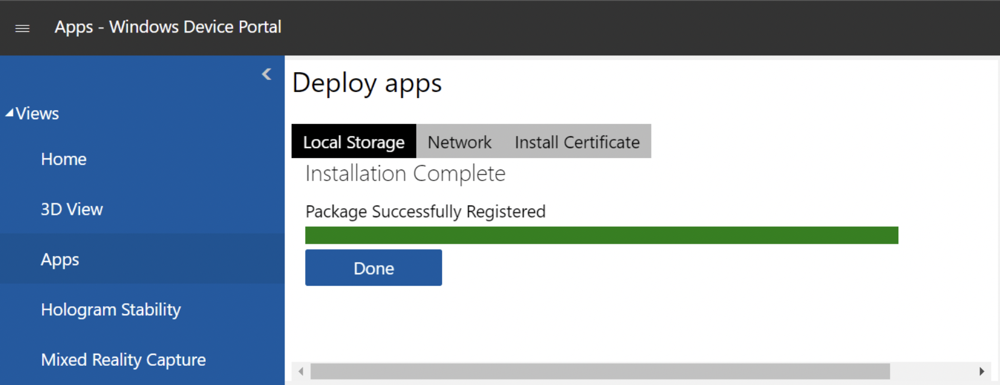

# Build and Deploy

## Unity Build

The first thing we need to do to create an app package is to build the Unity project. To do so, navigate to File -> Build Settings in Unity. Select Universal Windows Platform as a Platform (it should be selected by default). Pick the following configuration:

- `Target Device`: `HoloLens`;
- `Architecture`: `ARM64`;
- `Build Type`: `D3D Project`;
- `Target SDK Version`: `Latest installed`;
- `Minimum Platform Version`: `10.0.10240.0`;
- `Visual Studio Version`: `Latest installed`;
- `Build and Run on`: `Local Machine`;
- `Build configuration`: `Release`;
- `Compression Method`: `Default`;
- And leave the rest of the options unchecked.

Press on Build, and select a folder where to build the project. It would be best to create a new folder outside of the project folder and choose this new one as the build location. After selecting the folder, please wait for the build to finish (it will take some minutes).

The GIF below shows the building process in Unity.

## Visual Studio Package Creation

Now that we built the Unity project, we need to create the App Package using Visual Studio. To do so, follow these steps:

1. Go to the build folder, and open the solution file (Surgery.sln). Keep in mind that Visual Studio could take some time to open and load the project.
2. On the Solution Explorer of Visual Studio (on the right of the screen), expand Surgery (Universal Windows), and double click on `App.h`. Wait until the loading is finished.
3. Click on Project -> Publish -> Create App Packages...
4. Select Sideloading as distribution method and press Next.
5. Select the current certificate as a signing method and press Next.
6. Be careful with the selection of packages. Check only ARM64 as Architecture, and select Release (ARM64) as Solution Configuration. To ensure consistent version numbering check the latest release on Github and use a consecutive number. After the first version you built on your computer, Visual Studio will automatically use consecutive numbers every time you build.
7. Press Create and wait for it to finish. This process takes some minutes.

Below is a GIF explaining the deployment process.

### Find the App Packages

When Visual Studio has finished the creation pipeline, we will look for the packages in the folder we used to build the project. The path to the app package in the build folder is AppPackages -> Surgery -> Surgery\_`VERSION`\_ARM64_Test

### Directly debugging on the HoloLens

If needed it is possible to directly debug on the HoloLens before creating the appx package. In Visual Studio before clicking play, go to `Project -> Surgery Properties -> Debugging` and insert the HoloLens' IP under `Machine Name`. Be also sure that both the computer and the HoloLens are connected to the same network. Finally, select `Remote Machine` and press play. This will deploy the application to the HoloLens.

## Deploying to the HoloLens

Please note that on this section I will repurpose [this page of documentation from Microsoft](https://docs.microsoft.com/en-us/windows/mixed-reality/develop/platform-capabilities-and-apis/using-the-windows-device-portal#connecting-over-wi-fi).

### Connecting via WiFi

1. Connect your HoloLens to Wi-Fi.
2. Look up your device's IP address by either:
    - Going to Settings > Network & Internet > Wi-Fi > Advanced Options.
    - Going to Settings > Network & Internet and selecting Hardware properties.
    - Using the "What's my IP address?" voice command.
3. From a web browser on your PC, go to `https:/<YOUR_HOLOLENS_IP_ADDRESS>`The browser will display the following message: "_There's a problem with this website's security certificate_" because the certificate, which is issued to the Device Portal is a test certificate. You can ignore this certificate error for now and continue.
4. Enter your username and password to log in to the developer portal.

### Installing the App

1. In Windows Device Portal, navigate to the _Apps_ manager page.
2. Before installing the application, uninstall any previous version if present in the device. To do so, select the Surgery App on the dropdown menu under _Installed apps_ and press Remove.
3. Now let's install our package. In the _Deploy apps_ section, select _Local Storage_.
4. Under _Select the application package_, select _Choose File_ and browse to the app package we created using Visual Studio.
5. Select Install to start the installation.
6. Once the installation is complete, the Surgery app with the new patient is successfully installed in the HoloLens 2 device.

## Creating a Github Release

To keep track of previous releases and to make sure all team members can access the newest package version, create a Github release with the appx or appxbundle file, whenever a new feature has been implemented.

1. On the main page of the Github repository navigate to `Create a new release` (under Releases, right side of the page)
2. Choose a tag: write the version number of your release as a new tag
3. Target: choose the branch from which you created your release, usually `main` for a stable release
4. Write a release title and comment (`Generate release notes` automatically links a history of commits and pull requests), mention which patient is loaded into the HoloLens
5. Attach your appx file from your computer in the drag & drop section at the bottom
6. Once you are done, click `Publish release`
