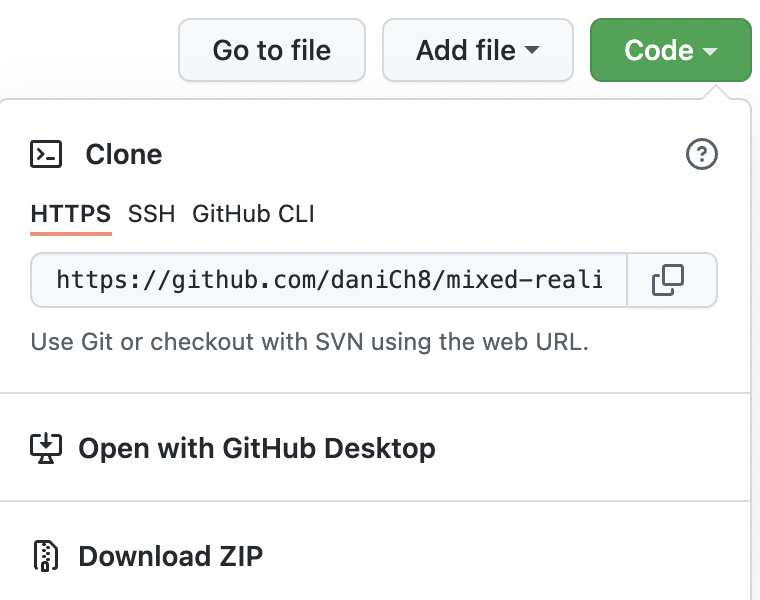
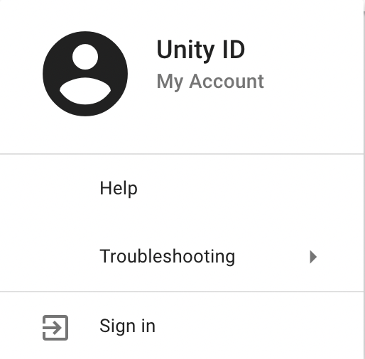
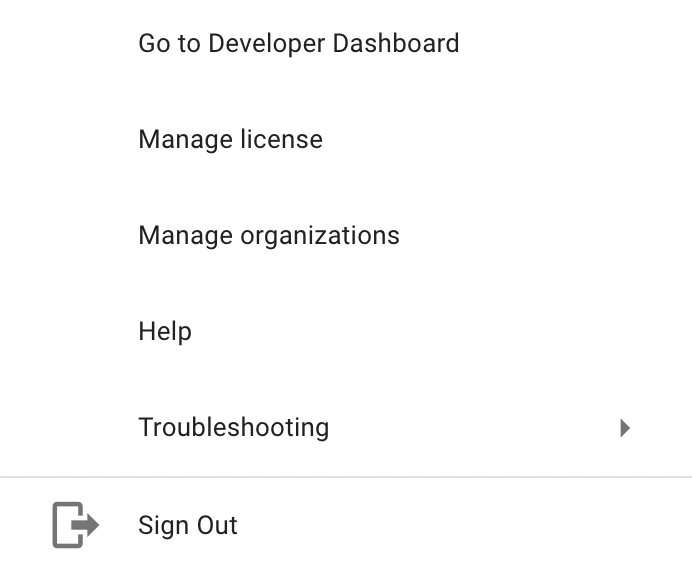
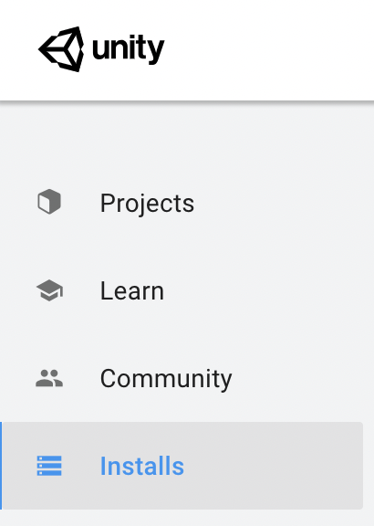
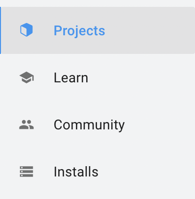
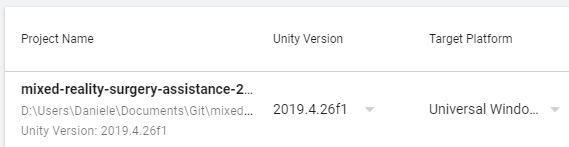
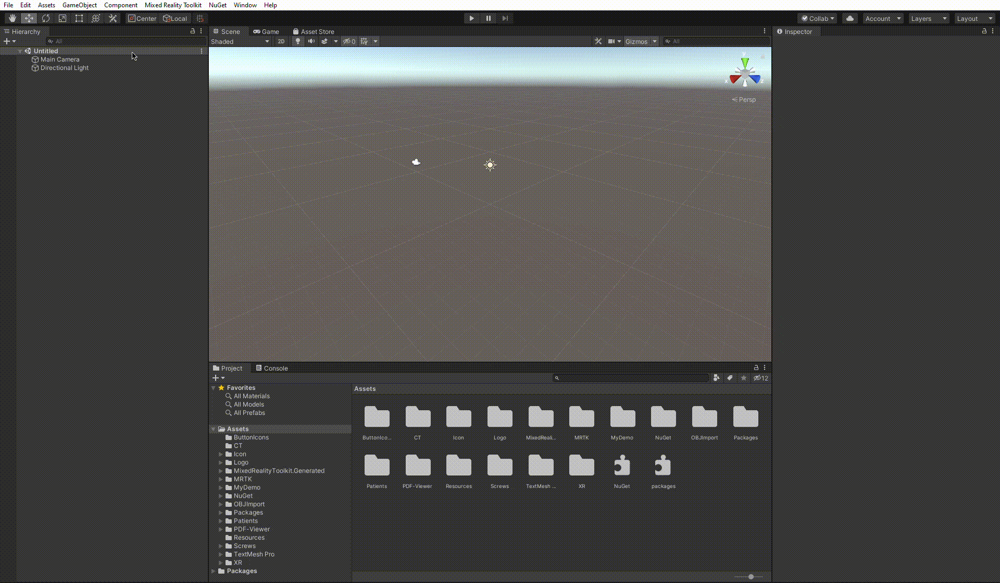

# Installation instructions

## Downloads and installations

### Unity Hub

[Download here](https://unity3d.com/get-unity/download). The Unity Hub is a management tool that you can use to manage all of your Unity Projects and installations.

### Unity v2019.4.26f1

[Download here](https://unity3d.com/unity/qa/lts-releases?version=2019.4). On the linked website, expand LTS Release 2019.4.26f1, and click on Download (Win) or Download (Mac) based on the OS you use. Use the downloaded file to install Unity, and remember the installation location because we will need it later. You can also chose Unity Hub as installation method, which will directly add this version in Unity Hub.

When installing, Unity will ask what components to install. Select **Universal Windows Platform Build support** and **Windows Build support**.

### Visual Studio

[Download the Community version here](https://visualstudio.microsoft.com/). Visual Studio is a full-featured IDE to code, debug, test, and deploy to any platform. We will need it to build the application with the new patients loaded. On the installer, you have to tick the following boxes:

- **.NET desktop development**
- **Desktop development with C++**
- **Universal Windows Platform development**
- **Game development with Unity**

### Project Download

[Download the project folder here](https://github.com/SimonCom/AR). Press on _Code_ and clone the Github repository either using https or ssh. If you are using it only for a one-time thing and will not continue the development of the app you can also download the zip folder. Keep in mind that the project's size is roughly 800 MB.

## Initial setup

### Unity Account

First, we will need to set up a Unity Account to use Unity and Unity Hub. Open Unity Hub and press the account button on the right.

Press on Sign in in the menu.

From here, create a new account if you don't have one, or sign in to your account.

### Unity Hub License

Now that we are logged in Unity Hub, we need to create a license to use Unity. Open Unity Hub and press the account button on the right. Click on Manage license from the menu.

You can create a new license by pressing on _Activate new license_ and select _Unity Personal_ as a License Agreement.

### Unity Location

**Note:** If you chose the method of installing directly through Unity Hub you can skip to the next step.  
We need to wire the Unity Version we installed with Unity Hub. To do so, open Unity Hub and go to Installs through the menu on the left.

Press on the _Locate_ button and select the Unity installation folder you used in the [Unity Installation](#unity-v2019426f1).

### Project Location

We need to locate the project folder in Unity Hub. To do so, open Unity Hub and go to Projects through the menu on the left.

From here, press the _Add_ button and select the project folder you used in the [Project Download](#project-download).

### Open the Project

In Unity Hub, open the project by pressing it in the project list. Before opening it, remember to select 2019.4.26f1 as Unity Version and Universal Windows Platform as Target Platform. Keep in mind that opening the project might take some time, especially the first time.

### Project Setup

If it is the first time you open the project, you will need to select the right scene to work on. To do so, you have to:

1. Navigate to Assets -> MyDemo in the project folders on the bottom of the screen.
2. Drag and drop SampleScene.unity in the hierarchy.
3. Remove the default scene.

You can see this process in the GIF below.

Now you are ready to start developing the app.

### CT Scans

**Important**: the CT scans are not kept inside this repository but have to be downloaded separately from the internal server. Before working building the project or continuing development, download the correct nrrd file from the server and rename it to have a bytes extension instead. They can be placed inside the local repository and they will not be tracked by Git. Create a folder called `CT` in the patient folder you would like to use. Then drag and drop the CT scan from the Unity Project window to the Scans One / Scans Two (depending which patient you are using) slot in PatientController. This step is explained in more detail [here](/doc/patient-switch-instructions.md).
