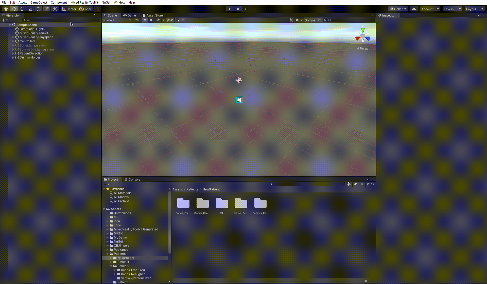
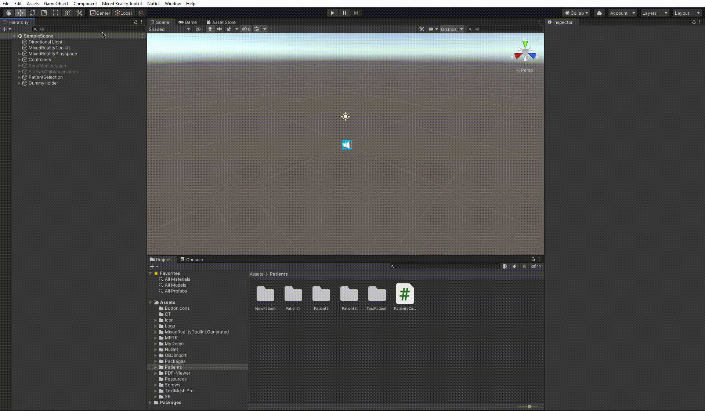
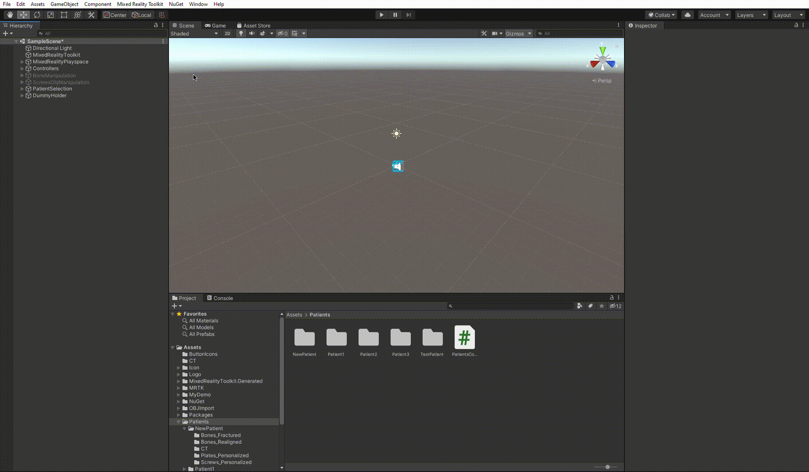

# Changing Patient in Unity

Create a new folder for your patient on your computer and copy the 3dm Rhino model from the server into this folder.

## Exporting and converting the required patient files

### CT scan

Create a `CT` folder in your new patient folder you created before.

Steps:

**If you already have a nrrd file:**

* If you need to crop it: determine the outer points from MITK-GEM and crop the nrrd file using [this](https://github.com/SimonCom/CustomSurg/blob/main/Segmentation/imageCropping.ipynb) notebook.
* If you don't need to crop it: use [this](/Assets/CT/convert.py) python script to convert the nrrd-file to the right format. How to use the script: open a terminal, navigate to the folder where you saved the script and write: `python convert.py <replace with path to nrrd file>`

**If you need to create a nrrd file:**

1. load the DICOM into MITK-GEM and export the CT scan as an nrrd-file
2. If needed, crop the file using MITK-GEM or use [this](https://github.com/SimonCom/CustomSurg/blob/main/Segmentation/imageCropping.ipynb) jupyter notebook.

   * if you cropped the CT scan you can skip to step 5
   * it is possible that if the CT is cropped it overlaps in the HoloLens (unknown why)

3. If you don't want to crop the CT scan you need to convert the nrrd file to the correct format using [this](/Assets/CT/convert.py) python script (this conversion is already included if you crop it with the notebook). How to use the script: open a terminal, navigate to the folder where you saved the script and write: `python convert.py <replace with path to nrrd file>`

**Last step: file extension**

To use the CT scan in the HoloLens you need to change the file extension from .nrrd to .bytes (change the name from the file explorer) and copy the .bytes file into the CT folder of your patient.

### Bone fragments, plates and screws

Open the 3dm patient model using Rhino and run [this](https://github.com/SimonCom/CustomSurg/blob/main/Rhino/ExportObjects_hololens_cmd.py) python script to export all .obj files and correct screw coordinate files. It creates several folders containing all the required .obj files and .txt files in the same folder as the Rhino model is saved.

## New Patient Setup in Unity

First, you need to import the patient data into the Unity project. Drag and drop the patient folder you created before into the `Assets/Patients/Patient_1` or `Assets/Patients/Patient_2` folder in this repository (1 & 2 refers to the patient number on the HoloLens). Make sure to delete the 3dm Rhino model before.

This process is shown in the GIF below.

### `PatientsController` Attributes

To set up the new patient, we will first need to change the attributes of the PatientsController. The app supports up to two patients right now. For this guide, let's use the PatientOne features to store the new patient. We have to perform the following steps:

1. Select the `PatientsController` in the hierarchy.
2. Put the new variables in the appropriate fields of the inspector. We will need to update the following attributes:
    * `Scans One`, where we will put the new patient's scan. **The scans should have the `.bytes` extension. Once you generated the `ct.nrrd` file, simply rename it to`ct.bytes`**
    * `Lat Screw One`, where we will put the new patient's lat screw positions (or None, if there are no lat screws for this patient).
    * `Med Screw One`, where we will put the new patient's med screw positions (or None, if there are no med screws for this patient).
    * `Dist Screw One`, where we will put the new patient's lone screw positions (or None, if there are no lone screws for this patient).
    * To assign `None` to values that a patient does not have, click on the pointer to the right of the attribute and select `None` from the dropdown menu. You can watch the GIF below to see it in action.

Below is a GIF showing the full process.

### `BoneManipulation` Attributes

Now, we will need to update the patient references in the `BoneManipulation` scene. Let's see what steps we should follow:

1. Navigate to `BoneManipulation` -> `Bone_1` -> `BoneGroup` -> `Patient1` in the hierarchy.
2. Select all the objects under `Patient1` in the hierarchy, right-click on the selection, and press _Delete_.
3. Drag and drop all the fractured bone objs from folder `fragments_fractured` (if created with previously mentioned script) under `Patient1` in the hierarchy.
4. Select all the created objects, right-click on the selection, and press _Unpack Prefab Completely_.

The GIF below shows this process.

### `ScrewObjManipulation` Attributes

Now, we will need to update the patient references in the `ScrewObjManipulation` scene. Let's see what steps we should follow:

1. Navigate to `ScrewObjManipulation` -> `BoneMix` -> `Patient1` in the hierarchy.
2. Select all the objects under `Patient1` -> `Plates` in the hierarchy, right-click on the selection, and press _Delete_.
3. Drag and drop all the plate objs from the `plates` folder to `Patient1` -> `Plates` in the hierarchy. You can skip this step if there are no plates for this patient.
4. Select all the created objects, right-click on the selection, and press _Unpack Prefab Completely_.
5. Select all the objects under `Patient1` -> `Bone` -> `MainBone` in the hierarchy, right-click on the selection and press _Delete_.
6. Select all the objects under `Patient1` -> `Bone` -> `FractureCollection` in the hierarchy, right-click on the selection and press _Delete_.
7. Drag and drop the main bone obj from the folder `fragments_aligned` to `Patient1` -> `Bone` -> `MainBone` in the hierarchy.
8. Select the created bone object, right-click on the selection, and press _Unpack Prefab Completely_.
9. Drag and drop all the realigned fracture bone objs from the folder `fragments_aligned` to `Patient1` -> `Bone` -> `FractureCollection` in the hierarchy.
10. Select all the created bone objects, right-click on the selection, and press _Unpack Prefab Completely_.

The GIF below shows this process.

### Save the scene

The new patient is now ready to be used! Let's not forget to save the scene to make sure that our changes will be used during the build. To do so, from Unity, go to File -> Save. Then proceed with [this](/doc/building-project.md) guide to build the project using the new patient data.

